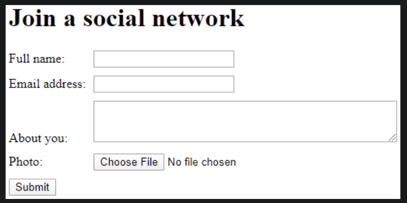

3.10 LAB: Form for joining a social network (HTML)
Create a web form as shown below that allows the user to enter personal information for joining a social network. The webpage uses CSS to align the form widgets vertically.

Example social network web page screenshot

The form should:

Use the POST method and the "multipart/form-data" enctype
Submit to https://wp.zybooks.com/form-viewer.php
Use a `<label>` for each form field and the label text shown in the image above
Use a `
` to surround each label and form widget and a `
` around the submit button
Use a text `<input>` with name and id "fullName" to get the user's name
Use a text `<input>` with name and id "email" to get the user's email address
Use a `<textarea>` with 3 rows, 50 columns, and name and id "about" to get a short description about the user
Use a text `<input>` with type "file" and name and id "picture" to get the user's image
Use a submit `<input>` button
Use the required attribute for name and email fields